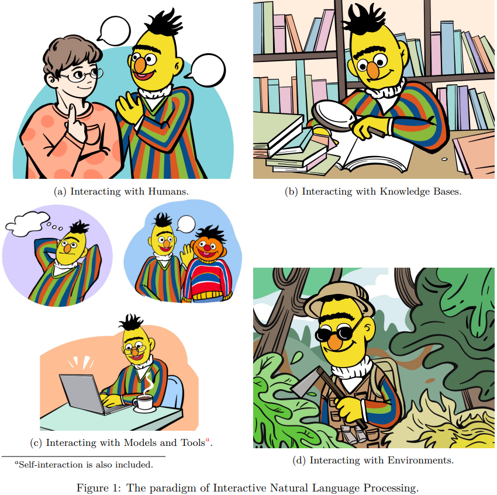

# 🔥Interactive NLP Papers

Must-read papers on [Interactive NLP](https://arxiv.org/abs/2305.13246): a new paradigm of NLP.

## Content

- [What is Interactive NLP?](#what-is-interactive-nlp)
- [Keywords Convention](#keywords-convention)
- [Paper](#paper)
  - [Surveys and Position Papers](#surveys-and-position-papers)
  - [Human-LM Interaction](#human-lm-interaction)
  - [KB-LM Interaction](#kb-lm-interaction)
  - [Model/Tool-LM Interaction](#model-tool-lm-interaction)
  - [Environment-LM Interaction](#environment-lm-interaction)
  - [Evaluation](#evaluation)
  - [Application](#application)
- [Related Projects](#related-projects)
- [Contribution](#contribution)
  - [Contributors](#contributors)
  - [Contributing to this paper list](#contributing-to-this-paper-list)

## What is Interactive NLP?

**Interactive Natural Language Processing (iNLP)** considers language models as agents capable of observing, acting, and receiving feedback in a loop with external objects such as humans, knowledge bases, tools, models, and environments, where: 

- **Observation** involves all kinds of inputs to language models. 
- **Action** involves all kinds of outputs of language models such as text generation, requesting for external objects, text editing, etc. 
- **Feedback** involves feedback messages passed from external objects to language models such as scoring from humans.

In iNLP, language models can interact with four kinds of objects (i.e., entities): 

- interact with **humans** for better understanding and addressing user needs, personalizing responses, aligning with human values, and improving the overall user experience;
- interact with **knowledge bases** for enriching language representations with factual knowledge, enhancing the contextual relevance of responses, and dynamically leveraging external information to generate more accurate and informed responses;
- interact with **models/tools** for effectively decomposing and addressing complex tasks, leveraging specialized expertise for specific subtasks, and fostering the simulation of social behaviors;
- interact with **environments** for learning grounded representations of language, and effectively tackling embodied tasks such as reasoning, planning, and decision-making in response to environmental observations.

## Keywords Convention

 The abbreviation of the work.

 The interaction method used by the work.

 Other important information of the work.

## Paper

### Surveys and Position Papers

- **[Interactive Natural Language Processing](https://arxiv.org/abs/2305.13246)**, 2023.05 

  *Zekun Wang, Ge Zhang, Kexin Yang, Ning Shi, Wangchunshu Zhou, Shaochun Hao, Guangzheng Xiong, Yizhi Li, Mong Yuan Sim, Xiuying Chen, Qingqing Zhu, Zhenzhu Yang, Adam Nik, Qi Liu, Chenghua Lin, Shi Wang, Ruibo Liu, Wenhu Chen, Ke Xu, Dayiheng Liu, Yike Guo, Jie Fu*.

- **[Tool Learning with Foundation Models](https://arxiv.org/abs/2304.08354)**, 2023.04  

  *Yujia Qin, Shengding Hu, Yankai Lin, Weize Chen, Ning Ding, Ganqu Cui, Zheni Zeng, Yufei Huang, Chaojun Xiao, Chi Han, Yi Ren Fung, Yusheng Su, Huadong Wang, Cheng Qian, Runchu Tian, Kunlun Zhu, Shihao Liang, Xingyu Shen, Bokai Xu, Zhen Zhang, Yining Ye, Bowen Li, Ziwei Tang, Jing Yi, Yuzhang Zhu, Zhenning Dai, Lan Yan, Xin Cong, Yaxi Lu, Weilin Zhao, Yuxiang Huang, Junxi Yan, Xu Han, Xian Sun, Dahai Li, Jason Phang, Cheng Yang, Tongshuang Wu, Heng Ji, Zhiyuan Liu, Maosong Sun*.

- **[Augmented Language Models: a Survey](https://arxiv.org/abs/2302.07842)**, 2023.02  

  *Grégoire Mialon, Roberto Dessì, Maria Lomeli, Christoforos Nalmpantis, Ram Pasunuru, Roberta Raileanu, Baptiste Rozière, Timo Schick, Jane Dwivedi-Yu, Asli Celikyilmaz, Edouard Grave, Yann LeCun, Thomas Scialom*.

- **[Foundation Models for Decision Making: Problems, Methods, and Opportunities](https://arxiv.org/abs/2303.04129)**, 2023.03  

  *Sherry Yang, Ofir Nachum, Yilun Du, Jason Wei, Pieter Abbeel, Dale Schuurmans*.

### 👨‍💼Human-LM Interaction

### 📚KB-LM Interaction

### 🤖Model/🛠Tool-LM Interaction

### 🌎Environment-LM Interaction

### 👍Evaluation

### 🎨Application

## Related Projects

- **[ToolLearningPapers](https://github.com/thunlp/)**
- **[BMTools](https://github.com/OpenBMB/BMTools)**
- **[AgentVerse](https://github.com/OpenBMB/AgentVerse)**
- **[ChatArena](https://github.com/chatarena/chatarena)**
- **[ChatGPT Plugins](https://platform.openai.com/docs/plugins/)**
- **[LangChain](https://github.com/hwchase17/langchain)**
- **[AutoGPT](https://github.com/Significant-Gravitas/Auto-GPT)**
- **[BabyAGI](https://github.com/yoheinakajima/babyagi)**

## Contribution

### Contributors

### Contributing to this paper list

- There are cases where we miss important works in this field, please contribute to this repo! Thanks for the efforts in advance.
